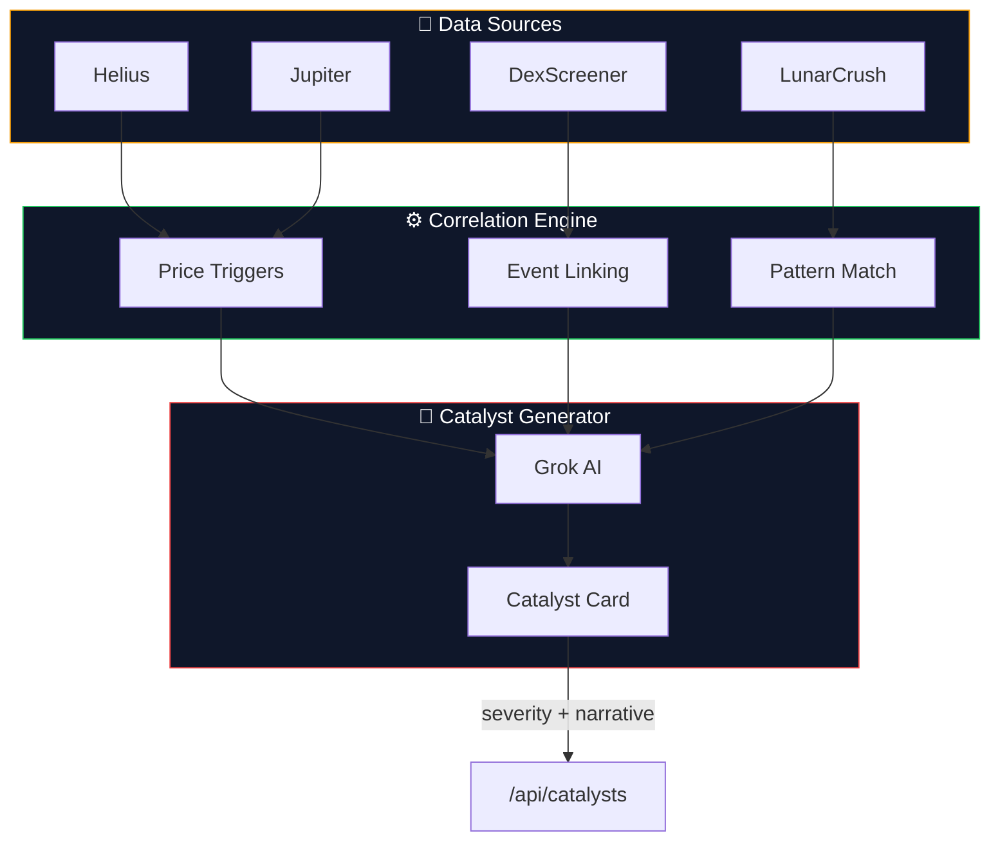

<div align="center">
  
  <p><strong>Real-time catalyst detection system that explains why Solana tokens are pumping/dumping with structured event cards.</strong></p>
</div>

# Catalysts

**Real-time catalyst detection system that explains why Solana tokens are pumping or dumping with structured event cards.**

Catalysts transforms chaotic crypto market movements into structured insights. Instead of just showing price charts, it generates "catalyst cards" - AI-powered explanations of token price movements linked to on-chain events, whale activity, and social signals. Each catalyst includes severity ratings, time horizons, evidence links, and directional bias to help you understand *why* tokens move, not just *that* they moved.

**⚠️ Status: Learning project (abandoned) - code available for reference**

## What It Does

- **Real-time monitoring** of Solana tokens for significant price movements
- **Catalyst card generation** - structured explanations of why tokens pump/dump
- **Multi-source correlation** - links on-chain events, social activity, and market data
- **AI-powered narratives** using Grok/xAI to explain complex market events
- **Severity classification** - HIGH/MEDIUM/LOW impact with time horizon predictions

## Catalyst Card Format

Each catalyst follows a structured data model:

```typescript
{
  token: "PEPE",
  type: "whale_movement",
  severity: "HIGH",
  timeHorizon: "SHORT_TERM",
  direction: "BEARISH",
  narrative: "Large holder transferred 2.5M tokens to Binance...",
  evidence: [
    { type: "solscan", url: "https://..." },
    { type: "arkham", url: "https://..." }
  ],
  confidence: 0.85
}
```

## Architecture



## Tech Stack

- **Frontend**: Next.js 14, React, TypeScript, Tailwind CSS
- **APIs**: Helius (on-chain), Jupiter (prices), DexScreener (market data), Grok/xAI (AI), LunarCrush (social)
- **Architecture**: Service-based with correlation engine and webhook support

## Key Files

```
src/
├── lib/
│   ├── catalyst-generator.ts    # Core catalyst creation logic
│   ├── services/
│   │   ├── correlation.ts       # Event correlation engine
│   │   ├── grok.ts             # AI narrative generation
│   │   └── helius.ts           # On-chain event monitoring
├── components/
│   ├── CatalystCard.tsx        # Main catalyst display component
│   └── SeverityBadge.tsx       # Visual severity indicators
└── app/api/
    ├── catalysts/              # Main catalyst feed endpoint
    └── webhooks/helius/        # Real-time event receiver
```

## Sample API Response

```json
{
  "catalysts": [
    {
      "id": "cat_123",
      "token": "BONK",
      "type": "social_surge",
      "severity": "MEDIUM",
      "timeHorizon": "SHORT_TERM",
      "direction": "BULLISH",
      "narrative": "Social mentions increased 340% in past 2 hours following Coinbase listing rumors...",
      "evidence": [
        {"type": "lunarcrush", "url": "https://..."},
        {"type": "twitter", "url": "https://..."}
      ],
      "timestamp": "2024-01-15T10:30:00Z",
      "confidence": 0.72
    }
  ]
}
```

## What Made This Interesting

The **catalyst card data model** is the core innovation - a structured way to represent crypto market intelligence that goes beyond simple price alerts. The correlation engine attempts to link:

- On-chain events (large transfers, new holders)
- Social signals (mention spikes, sentiment shifts)  
- Market structure (liquidity changes, trading patterns)
- Historical patterns (similar events, outcomes)

## Why It Was Abandoned

- **Data quality challenges** - correlating noisy crypto data is extremely difficult
- **API costs** - real-time monitoring across multiple sources gets expensive quickly
- **False positives** - AI narratives often hallucinated connections that didn't exist
- **Market complexity** - crypto moves for reasons that can't be easily structured

## Running Locally

```bash
# Clone and install
git clone https://github.com/yourusername/catalysts
cd catalysts
npm install

# Set up environment variables
cp .env.example .env.local
# Add your API keys for Helius, Jupiter, Grok, etc.

# Run development server
npm run dev
```

Visit `http://localhost:3000` to see the catalyst feed interface.

---

*This was a learning project exploring structured market intelligence for crypto. The catalyst card concept and correlation engine approach might be useful for similar projects.*